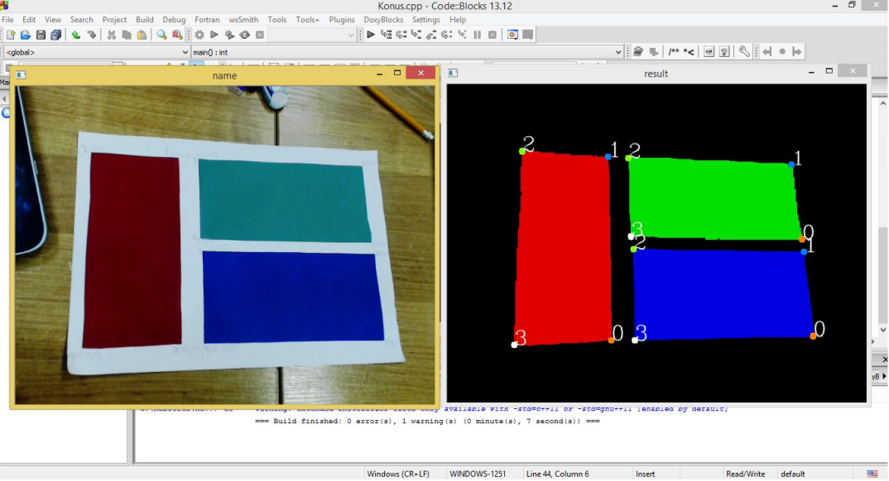

# Image-processing

**Постановка задачи** - найти 12 заранее заданных точек на листе.
===========
**Уточнение исходных и выходных данных и ограничений на них**
-------
***Входные данные*** - изображение с камеры, калибровочные значения цветов, координаты точек в реальном пространстве.
***Исходные данные*** - изображение с компонентами и номерами точек.
***
На изображении, получаемом с камеры, найти три максимальные компоненты связности трех разных цветов, предварительно выбрав цвета мышью с изображения, выделить их на втором изображении (закрасить их в заданные цвета, а все остальное изображение в черный цвет). Затем найти 4 крайние точки каждой компоненты.
***
**Пример работы программы**
--------

